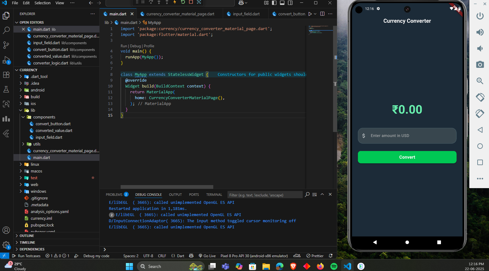

# 💱 Flutter Currency Converter

A simple and elegant **Flutter app** that converts USD to INR using a fixed exchange rate (`1 USD = ₹81`).

---

## 📸 Screenshot

<div align="center">
  
</div>

---

## 🚀 Features

- 💰 Converts USD to INR
- ⚙️ Modular Flutter code structure
- 🎯 Clean and responsive UI
- 📱 Uses basic `TextField`, `ElevatedButton`, and state management

---

## 🛠️ Project Structure

```bash
lib/
├── main.dart
├── currency_converter_material_page.dart
├── components/
│   ├── input_field.dart
│   ├── convert_button.dart
│   └── converted_value.dart
└── utils/
    └── converter_logic.dart
